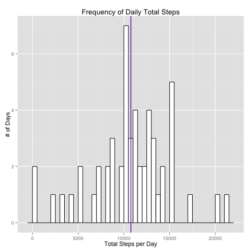
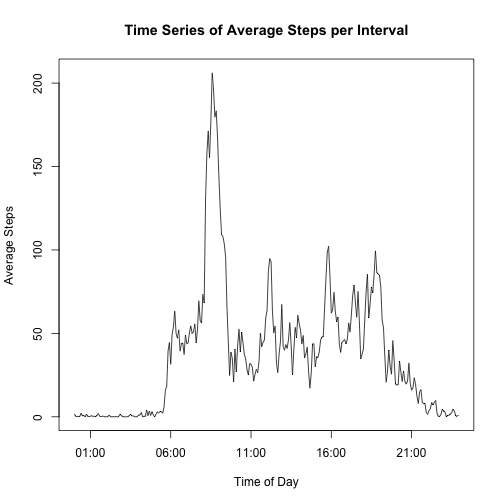
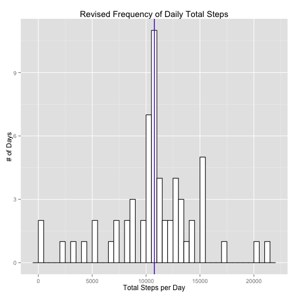
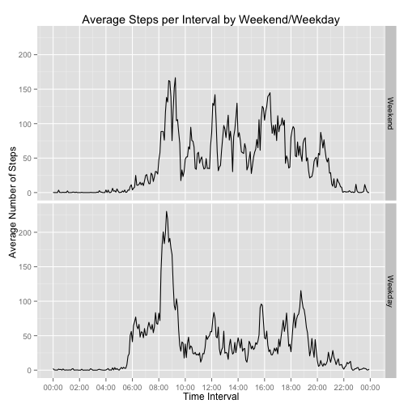

## Loading and preprocessing the data  
We have been instructed that the required datafile resides in the local directory, so the following code does not include instructions for downloading the file.


```r
library(data.table)
library(dplyr)
library(lubridate)
library(ggplot2)
library(scales)
```

After loading the required packages:   

- data.table  
- dplyr  
- lubridate  
- ggplot2 
- scales  

the original data file, *activity.zip*, is unzipped, with the resulting file *activity.csv* read from the working directory into a data.table called *activitydata*.  


```r
unzip("./activity.zip", exdir = ".")
activitydata <- as.data.table(read.csv("activity.csv", colClasses = c('integer', 'Date', 'character')))
head(activitydata, 3)
```

```
##    steps       date interval
## 1:    NA 2012-10-01        0
## 2:    NA 2012-10-01        5
## 3:    NA 2012-10-01       10
```

The *interval* variable shows five-minute intervals in 1- to 4-character strings indicating, inconsistently, hhmm on a 24-hour scale.  This variable is transformed into a consistent 4-character format by front-filling with 0's as necessary using the sprintf() function.  

A *newinterval* variable is then creating using a dummy date and the revised *interval* variable in order to create a time-based factor for summary analysis and plotting.  


```r
activitydata$interval <- sprintf("%04d", as.integer(activitydata$interval))
activitydata$newinterval <- ymd_hm(paste("2016-01-01", activitydata$interval))
head(activitydata, 3)
```

```
##    steps       date interval         newinterval
## 1:    NA 2012-10-01     0000 2016-01-01 00:00:00
## 2:    NA 2012-10-01     0005 2016-01-01 00:05:00
## 3:    NA 2012-10-01     0010 2016-01-01 00:10:00
```

## What is mean total number of steps taken per day?  
A new data frame, *stepsperday*, is prepared using the data.table() function on the *date* variable and summing the steps.  NA values are included so as not to appear in the results as days with 0 steps, which will skew subsequent plotting and analysis.  


```r
stepsperday <- activitydata[,.(totalsteps = sum(steps)), by=date]
head(stepsperday, 3)
```

```
##          date totalsteps
## 1: 2012-10-01         NA
## 2: 2012-10-02        126
## 3: 2012-10-03      11352
```

The histogram showing the frequency of total steps per day is binned in 500-step increments, with 2 vertical lines added to indicate the mean and median for the dataset.


```r
g <- ggplot(stepsperday) + aes(totalsteps) + geom_histogram(color = "black", fill = "white", binwidth = 500)+ labs(title = "Frequency of Daily Total Steps", x = "Total Steps per Day",  y = "# of Days")
g + geom_vline(xintercept = mean(stepsperday$totalsteps, na.rm=TRUE), color = "red") + geom_vline(xintercept = median(stepsperday$totalsteps, na.rm=TRUE), color = "blue")
```

 

The mean of total steps per day, now removing NA values is:  

```r
paste("Mean Steps per Day:", round(mean(stepsperday$totalsteps, na.rm = TRUE), digits = 2))
```

```
## [1] "Mean Steps per Day: 10766.19"
```

The median of total steps per day, again excluding NA values is:  

```r
paste("Median Steps per Day:", median(stepsperday$totalsteps, na.rm = TRUE))
```

```
## [1] "Median Steps per Day: 10765"
```

## What is the average daily activity pattern?
Another new data frame, *stepsperinterval*, is prepared using the summarise() function on the *newinterval* variable and taking the mean of the steps.  NA values are excluded so that the means do not evaluate to NA in any case where a single NA is present.  


```r
stepsperinterval <- activitydata[,.(avgsteps = mean(steps, na.rm=TRUE)), by=newinterval]
head(stepsperinterval, 3)
```

```
##            newinterval  avgsteps
## 1: 2016-01-01 00:00:00 1.7169811
## 2: 2016-01-01 00:05:00 0.3396226
## 3: 2016-01-01 00:10:00 0.1320755
```

A time series plot of the average step counts per interval is shown below:  


```r
plot(stepsperinterval$newinterval, stepsperinterval$avgsteps, type = "l", xlab = "Time of Day", ylab = "Average Steps", main = "Time Series of Average Steps per Interval")
```

 

The interval containing the maximum average number of steps can be calculated using the which.max() function, with the result formatted to exclude the dummy day:  


```r
maxsteps <- stepsperinterval[which.max(stepsperinterval$avgsteps),]
paste("Interval with Maximum Steps:", format(maxsteps$newinterval, '%H:%M'))
```

```
## [1] "Interval with Maximum Steps: 08:35"
```

## Imputing missing values
The number of missing values can be determined by summing the vector resulting from a call to is.na() on the *steps* variable.  The percentage of missing values is determined by dividing the result by the nrow() call on the same data.table.  


```r
paste("The number of missing values is ", sum(is.na(activitydata$steps)), sep = "")
```

```
## [1] "The number of missing values is 2304"
```

```r
paste("The percentage of missing values is ", round(sum(is.na(activitydata$steps))/nrow(activitydata)*100, digits = 2),"%", sep = "")
```

```
## [1] "The percentage of missing values is 13.11%"
```

I have elected to impute the missing values in the *step* variable by using the mean step-count value for each five minute interval.  I considered using the median value, as I feel that these would better represents the very few positive step counts during periods of little or no activity - specifically when the subject is sleeping, but determined that, throughout a day, the median values would result in extremely low aggregate step counts.  

The mean values previously calculated and rounded to the nearest whole step, are mapped to the new variable *newsteps* if the original *step* value is NA. Otherwise the original value is used.  

```r
activitydata$newsteps <- ifelse(is.na(activitydata$steps),round(stepsperinterval$avgsteps, digits = 0),activitydata$steps)
head(activitydata,3)
```

```
##    steps       date interval         newinterval newsteps
## 1:    NA 2012-10-01     0000 2016-01-01 00:00:00        2
## 2:    NA 2012-10-01     0005 2016-01-01 00:05:00        0
## 3:    NA 2012-10-01     0010 2016-01-01 00:10:00        0
```
  
The revised histogram showing the frequency of total steps per day is binned in 500-step increments, with 2 vertical lines added to indicate the mean and median for the dataset.  

```r
newstepsperday <- activitydata[,.(newtotalsteps = sum(newsteps)), by=date]
g <- ggplot(newstepsperday) + aes(newtotalsteps) + geom_histogram(color = "black", fill = "white", binwidth = 500)+ labs(title = "Revised Frequency of Daily Total Steps", x = "Total Steps per Day",  y = "# of Days")
g + geom_vline(xintercept = mean(newstepsperday$newtotalsteps), color = "red") + geom_vline(xintercept = median(newstepsperday$newtotalsteps), color = "blue")
```

 
  
  
The revised mean of total steps per day is calculated and subtracted from the original mean, after replacing NA values.  

```r
paste("The revised mean steps per day is now", round(mean(newstepsperday$newtotalsteps), digits = 2), "or a difference of", round(mean(stepsperday$totalsteps, na.rm=TRUE) -mean(newstepsperday$newtotalsteps), digits = 2), "from the original mean.")
```

```
## [1] "The revised mean steps per day is now 10765.64 or a difference of 0.55 from the original mean."
```
  
  
The revised median of total steps per day, again replacing NA values, is calculated and subtracted from the original median:  

```r
paste("The revised median steps per day is now", median(newstepsperday$newtotalsteps), "or a difference of", median(stepsperday$totalsteps, na.rm=TRUE) - median(newstepsperday$newtotalsteps), "from the original median.")
```

```
## [1] "The revised median steps per day is now 10762 or a difference of 3 from the original median."
```
  
The relatively minor variation from the original data suggests that the NA values tended to be clustered in full days, rather than intermittently throughout any given day.  
  
## Are there differences in activity patterns between weekdays and weekends?  
In order to determine the variation between average steps per interval over weekdays and weekends, a new *wday* factor variable is prepared using weekdays() to evaluate the *date* variable in the original data set.  

A new data.frame, *newstepsperinterval*, is prepared, using the step data with imputed values in place of NA entries, grouped by the variables *newinterval* and *wday*.  


```r
activitydata$wday <- factor((weekdays(activitydata$date) %in% c("Saturday", "Sunday")), levels=c(TRUE, FALSE), labels=c('Weekend', 'Weekday'))
newstepsperinterval <- activitydata[,.(avgsteps = mean(newsteps)), by=.(newinterval, wday)]
head(newstepsperinterval, 3)
```

```
##            newinterval    wday  avgsteps
## 1: 2016-01-01 00:00:00 Weekday 2.2888889
## 2: 2016-01-01 00:05:00 Weekday 0.4000000
## 3: 2016-01-01 00:10:00 Weekday 0.1555556
```
  
This data is then plotted using ggplot2 into a 1 by 2 lattice, with the facets

```r
wd <- ggplot(newstepsperinterval, aes(x=newinterval, y=avgsteps, group = 1))
wd + geom_line() + facet_grid(wday~.)+ ggtitle("Average Steps per Interval by Weekend/Weekday") + xlab("Time Interval") + ylab("Average Number of Steps")+ scale_x_datetime(breaks =     date_breaks("2 hours"), labels = date_format("%H:%M"))
```

 
